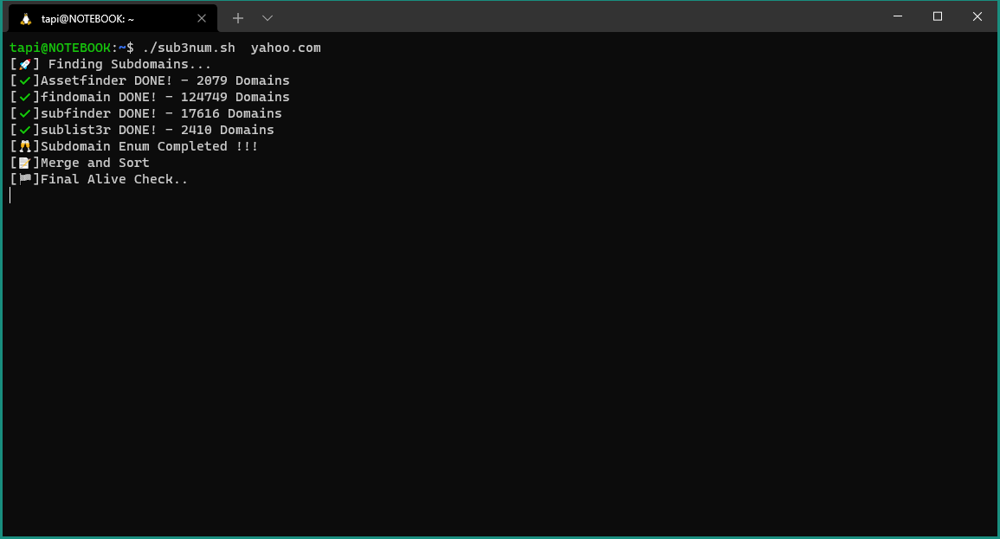

# Sub3num

A tool that automates subdomain enumeration by running various tools and combining the results. Finally giving all the **alive** subdomains.

* Tools used:
  * [Sublist3r](https://github.com/aboul3la/Sublist3r.git) 
  * [Assetfinder](https://github.com/tomnomnom/assetfinder)
  * [Subfinder](https://github.com/projectdiscovery/subfinder)
  * [findomain](https://github.com/Findomain/Findomain)
  * [Amass](https://github.com/OWASP/Amass)
  * [httprobe](https://github.com/tomnomnom/httprobe)

## Installation 

### Install Go
https://www.digitalocean.com/community/tutorial_collections/how-to-install-go

```
git clone https://github.com/saharshtapi/sub3num.git
cd sub3num
chmod +x *.sh
./install_tools.sh
```

## Usage 
```
./sub3num <target_domain>
```

## Demo
 </a>
